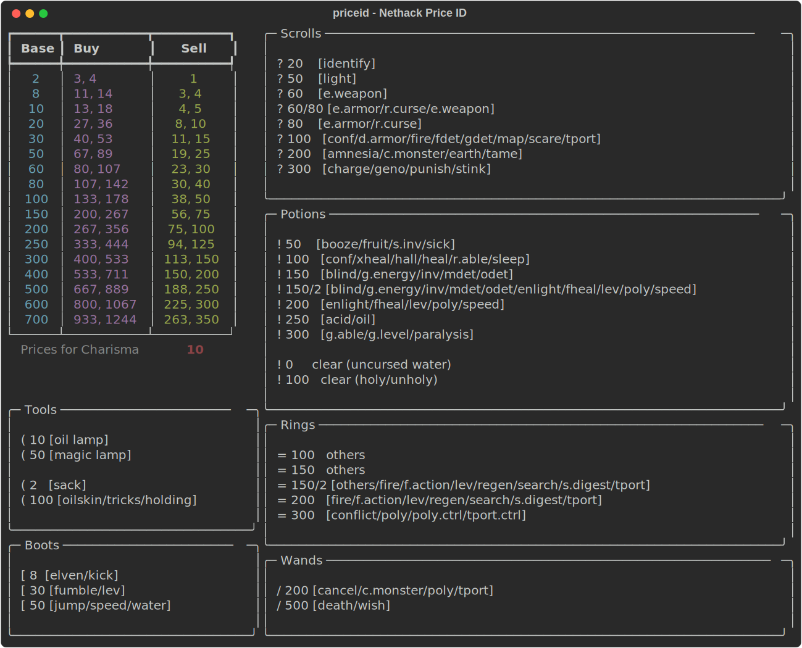

# priceid - Nethack Price ID

A NetHack price identification tool. Look up base prices, buy/sell values by charisma, and track identified items — all from the terminal.

This does not attempt to cover every item or item type. It focuses on the items I've found most useful to identify via shop price — scrolls, potions, rings, wands, and a handful of tools and boots. The idea is to enter a buy or sell price, see which base prices match, then copy/paste the narrowed-down candidates so you can `#name` them (type-name) in-game.

As you play and officially identify items (by using them, reading them, etc.), you can mark them as identified in the tool. This eliminates them from future match lists, so each subsequent price lookup gives you a tighter, more accurate set of candidates to type-name.

Everything is accessed through the **`priceid`** command — an interactive Textual TUI with live price search, item identification tracking, and persistent state. A `--print` flag is available for a quick static view of the price tables.

## Setup

Requires Python 3.13+ and [uv](https://docs.astral.sh/uv/).

```bash
# Create the virtual environment and install dependencies
uv sync --no-dev

# Activate the virtual environment
source .venv/bin/activate
```

## Usage

```bash
# Launch the interactive TUI
priceid

# Force small-screen mode
priceid --small

# Print a static price table and exit (default charisma 10)
priceid --print

# Print with a specific charisma
priceid --print 18

# Export the static view as SVG
priceid --print --svg priceid.svg
```




The TUI has two display modes: a full two-column layout for large terminals (105x35+) and a compact single-column mode for smaller terminals. The mode is chosen automatically based on terminal size, or can be forced with `--small`. Both modes share the same state file.

Keybindings:

| Key | Action |
|-----|--------|
| `p` | Search by base price |
| `b` | Search by buy price |
| `s` | Search by sell price |
| `i` | Toggle an item as identified |
| `c` | Set charisma |
| `d` | Show/hide identified items |
| `?` | Show item legend |
| `R` | Reset all state |
| `q` | Quit |

In small-screen mode, the status bar shows a `[S]` indicator and the current charisma. The default view is a scrollable single-column display of all prices and item panels (navigate with arrow keys, `j`/`k`, `Ctrl+D`/`Ctrl+U`). During price searches, only matching rows and item sections are shown; the full view is restored when the search ends.

## Development

```bash
# Install dev dependencies
uv sync --group dev

# Lint
uvx ruff check src/
uvx ruff format --check src/

# Type check
uvx pyright src/
```

### Generating demo assets

The static SVG screenshot is generated with `--print --svg`:

```bash
priceid --print --svg demo/print.svg
```

The animated GIF is generated with [vhs](https://github.com/charmbracelet/vhs):

```bash
brew install vhs
vhs demo/priceid.tape
vhs demo/priceid-small.tape
```
