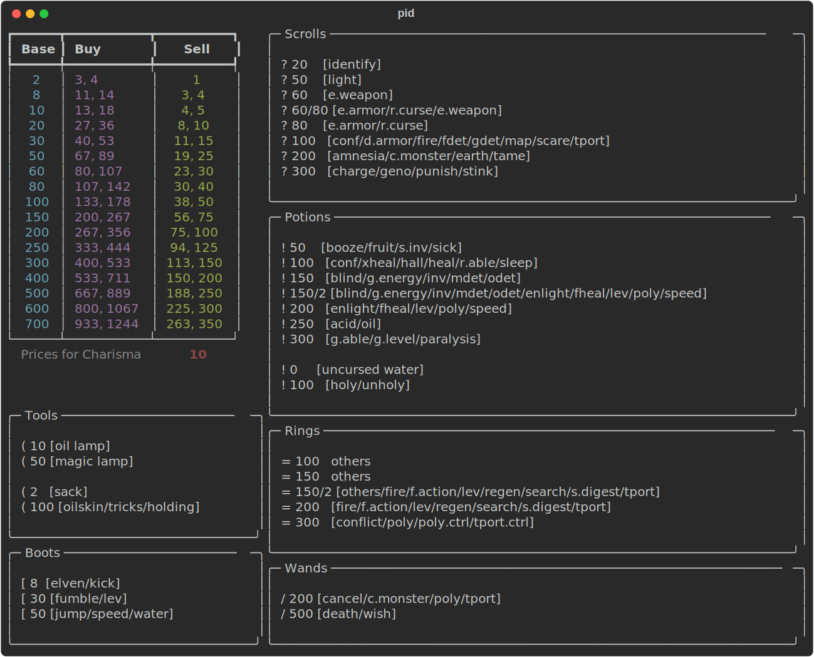

# priceid

A NetHack price identification tool. Look up base prices, buy/sell values by charisma, and track identified items — all from the terminal.

This does not attempt to cover every item or item type. It focuses on the items I've found most useful to identify via shop price — scrolls, potions, rings, wands, and a handful of tools and boots. The idea is to enter a buy or sell price, see which base prices match, then copy/paste the narrowed-down candidates so you can `#name` them (type-name) in-game.

As you play and officially identify items (by using them, reading them, etc.), you can mark them as identified in the tool. This eliminates them from future match lists, so each subsequent price lookup gives you a tighter, more accurate set of candidates to type-name.

Two commands are provided:

- **`pid`** — a static Rich-based display of price tables and item panels
- **`priceid`** — an interactive Textual TUI with live price search, item identification tracking, and persistent state

## Setup

Requires Python 3.13+ and [uv](https://docs.astral.sh/uv/).

```bash
# Create the virtual environment and install dependencies
uv sync --no-dev

# Activate the virtual environment
source .venv/bin/activate
```

## Usage

### `pid`

Prints a price table and item reference panels to the terminal.

```bash
# Default (charisma 10)
pid

# Specify charisma
pid 18

# Export as SVG
pid --svg pid.svg
```



### `priceid`

Launches an interactive TUI. State (charisma, identified items) is saved to `~/.config/priceid/state.json` and restored on next launch.

```bash
priceid
```


Keybindings:

| Key | Action |
|-----|--------|
| `p` | Search by base price |
| `b` | Search by buy price |
| `s` | Search by sell price |
| `i` | Toggle an item as identified |
| `c` | Set charisma |
| `d` | Show/hide identified items |
| `?` | Show item legend |
| `R` | Reset all state |
| `q` | Quit |

## Development

```bash
# Install dev dependencies
uv sync --group dev

# Lint
uvx ruff check src/
uvx ruff format --check src/

# Type check
uvx pyright src/
```

### Generating demo assets

The `pid` SVG screenshot is generated with the built-in `--svg` flag:

```bash
pid --svg demo/pid.svg
```

The `priceid` animated GIF is generated with [vhs](https://github.com/charmbracelet/vhs):

```bash
brew install vhs
vhs demo/priceid.tape
```
